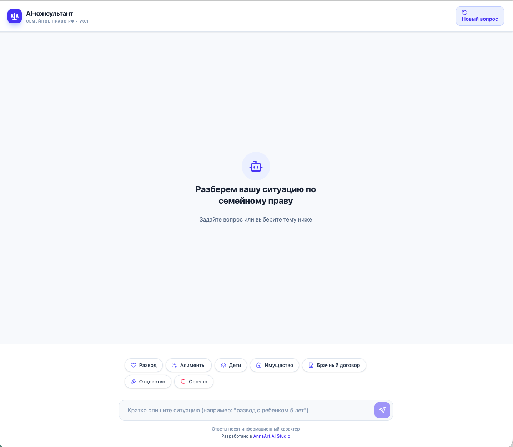
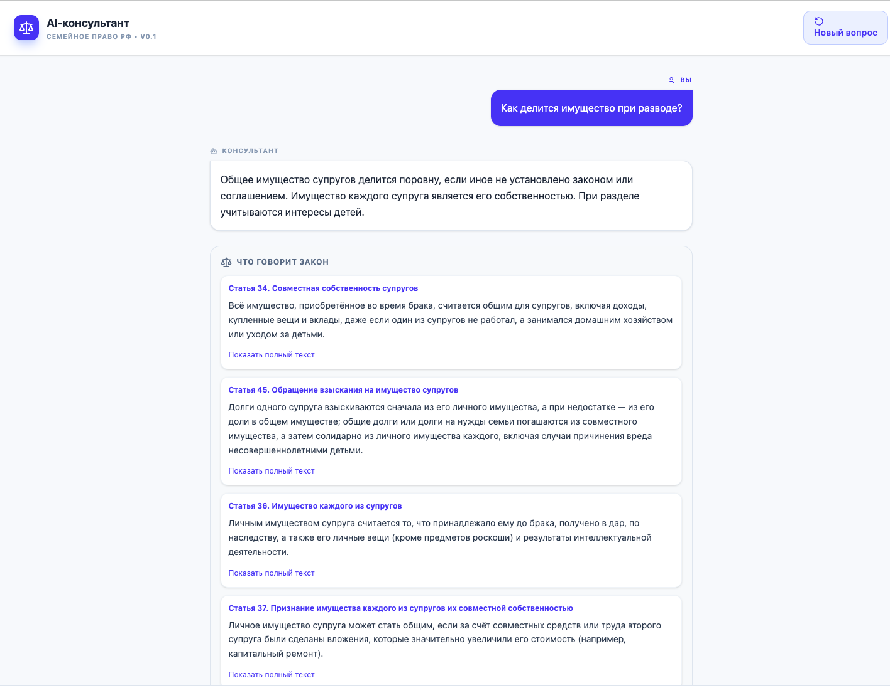
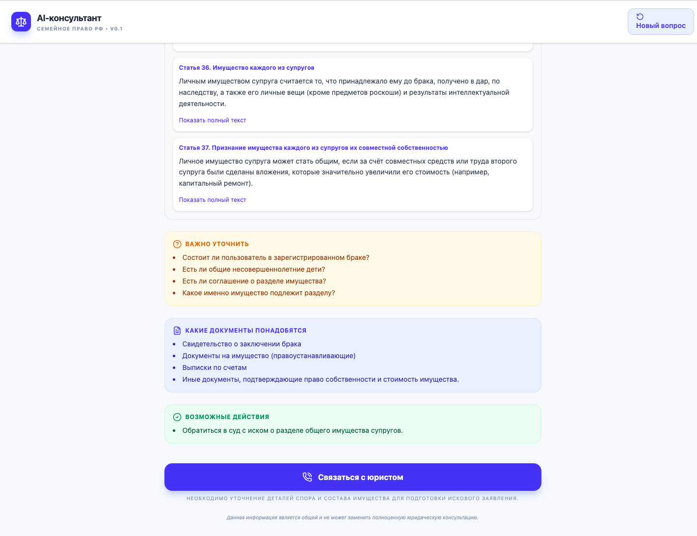

# 👨‍👩‍👧 AI-консультант по семейному праву

## AI-помощник для первичных юридических консультаций

Веб-приложение, предназначенное для предоставления первичных консультаций по вопросам семейного права с использованием современных языковых моделей.

Проект помогает пользователям получать понятные ответы на распространённые юридические вопросы, сохраняя удобный интерфейс и безопасное взаимодействие с AI-моделью.

> Проект завершён.

---

# 👩‍💻 Моя роль

В рамках проекта я отвечала за:

- проектирование архитектуры приложения;
- разработку backend;
- разработку frontend;
- интеграцию LLM через OpenRouter;
- проектирование API;
- разработку пользовательского интерфейса;
- обеспечение безопасного взаимодействия с AI-моделью.

---

# 🚀 Основные возможности

- 💬 Консультации по вопросам семейного права
- 🤖 Использование современных LLM для генерации ответов
- 🔒 Безопасная обработка пользовательских запросов
- 📱 Современный веб-интерфейс
- ⚡ Быстрый отклик благодаря оптимизированному backend

---

# 🛠️ Используемые технологии

### AI

- OpenRouter
- Gemini
- Prompt Engineering

### Backend

- Node.js
- Express.js

### Frontend

- React
- TypeScript
- Tailwind CSS

### Инструменты

- Git

---

# 📸 Интерфейс приложения

## Главная страница

---

## Консультация

---

## Пример ответа

---

> Исходный код проекта доступен в открытом репозитории GitHub.
