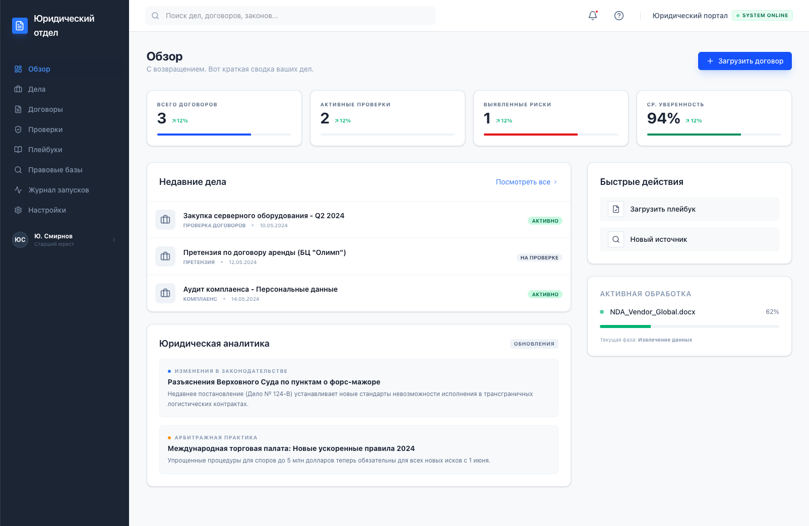
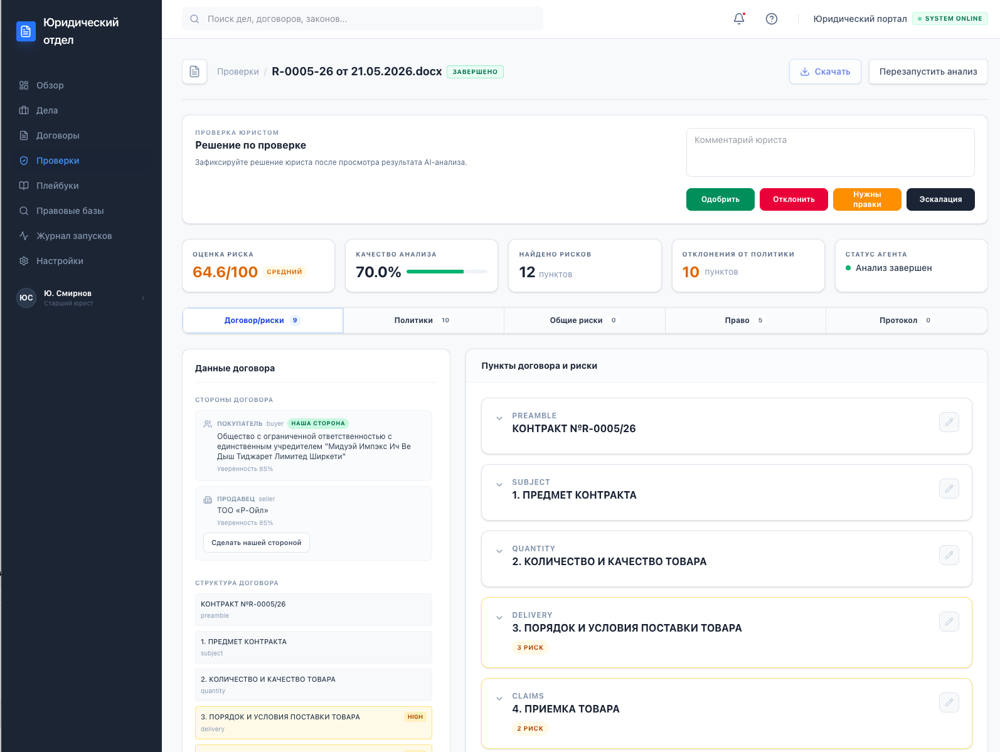
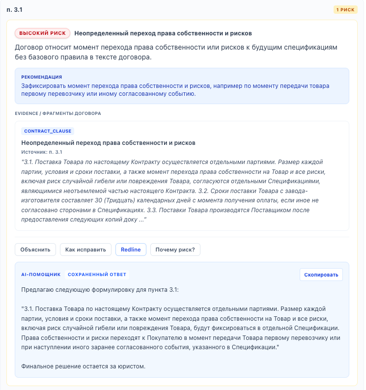
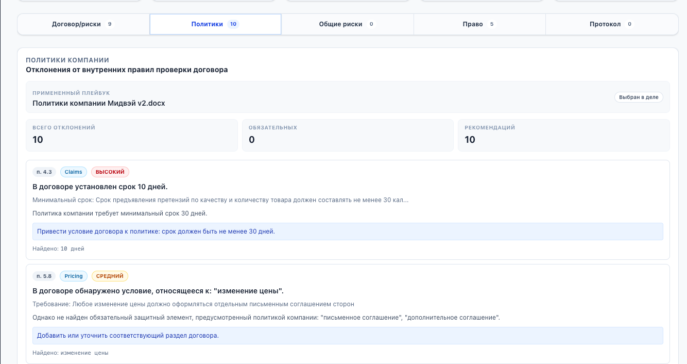
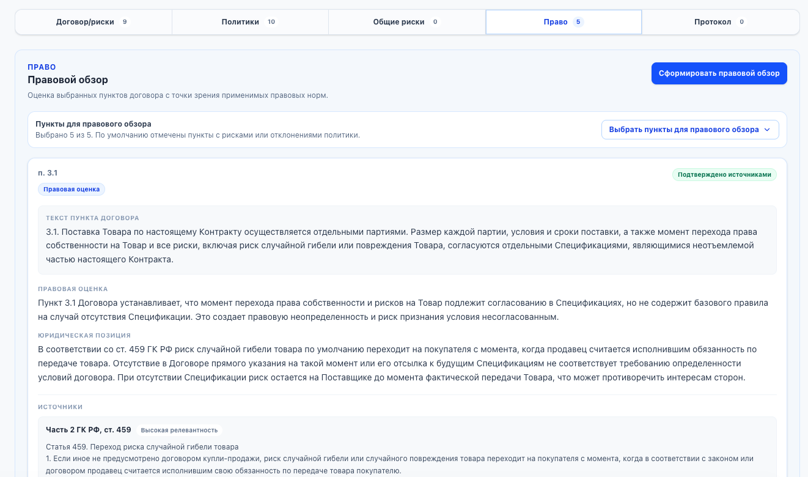

# ⚖️ AI Legal Platform

## AI-платформа для корпоративной проверки договоров

AI Legal Platform — интеллектуальная платформа, предназначенная для анализа коммерческих договоров, выявления юридических рисков, проверки соответствия корпоративным политикам и поддержки принятия юридических решений.

Система помогает юридическим отделам и бизнесу ускорить проверку договоров, снизить количество ручной работы и сделать процесс анализа более прозрачным и воспроизводимым.

> 🚧 Проект находится в активной разработке.

---

# 👩‍💻 Моя роль

В рамках проекта я отвечаю за:

- проектирование архитектуры платформы;
- разработку backend на FastAPI;
- проектирование AI-пайплайна анализа договоров;
- разработку Policy Engine;
- разработку Legal Retrieval (RAG);
- проектирование Review Workspace;
- разработку моделей данных и REST API;
- интеграцию современных LLM через OpenRouter.

---

# 🚀 Основные возможности

- 📄 Анализ договоров в формате DOCX
- ⚠️ Автоматическое выявление юридических рисков
- 📚 Проверка соответствия корпоративным политикам
- ⚖️ Семантический поиск по законодательству (RAG)
- 🤖 AI-сводка результатов анализа
- 📑 Современное рабочее пространство для анализа договора
- 📝 Подготовка данных для формирования протокола разногласий

---

# 🛠️ Используемые технологии

### AI

- OpenRouter
- LangGraph
- RAG
- Prompt Engineering

### Backend

- Python
- FastAPI
- SQLAlchemy
- Alembic
- Celery

### Frontend

- React
- TypeScript
- Tailwind CSS

### Базы данных

- PostgreSQL
- Qdrant

### Инфраструктура

- Docker
- Git

---

# 📸 Интерфейс платформы

## Главная страница

---

## Рабочее пространство анализа

---

## Анализ рисков

---

## Политики компании

---

## Правовые основания

---

> Исходный код проекта является приватным. В данном репозитории представлено описание проекта, используемых технологий и демонстрация интерфейса.
