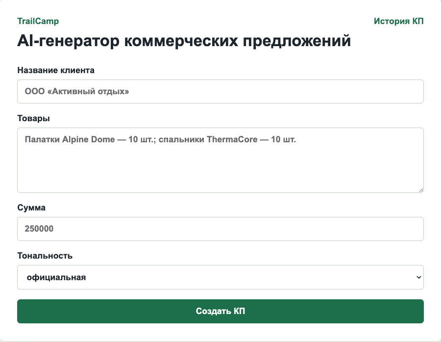
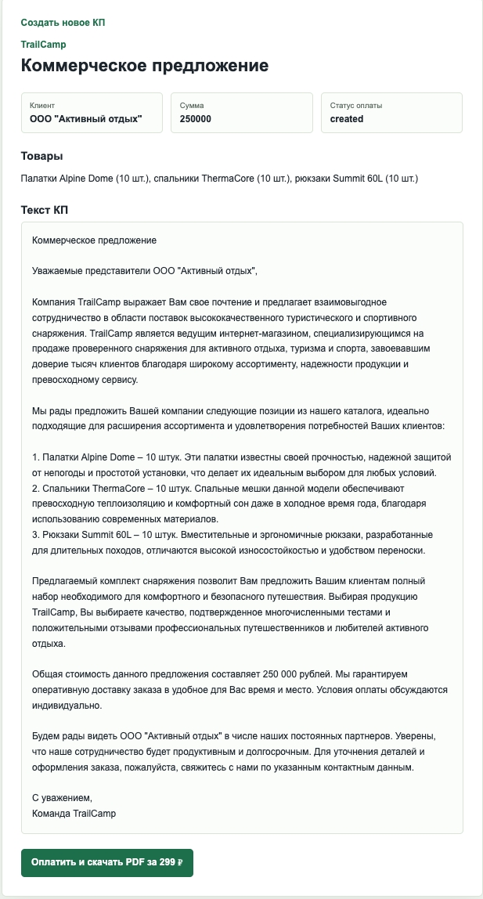

# 📄 AI Генератор коммерческих предложений

## AI-сервис для автоматизации подготовки коммерческих предложений

Веб-приложение для автоматического формирования коммерческих предложений на основе пользовательских данных и готовых шаблонов.

Сервис позволяет значительно сократить время подготовки документов, минимизировать количество ошибок и стандартизировать оформление коммерческих предложений.

> Проект завершён.

---

# 👩‍💻 Моя роль

В рамках проекта я отвечала за:

- проектирование архитектуры приложения;
- разработку backend;
- разработку frontend;
- интеграцию с платёжной системой ЮKassa;
- генерацию документов в формате PDF;
- разработку REST API;
- контейнеризацию приложения с использованием Docker.

---

# 🚀 Основные возможности

- 📄 Автоматическое формирование коммерческих предложений
- 📝 Заполнение шаблонов пользовательскими данными
- 📑 Генерация PDF-документов
- 💳 Интеграция с платёжной системой ЮKassa
- 🌐 Современный веб-интерфейс
- ⚡ Быстрая подготовка готового документа

---

# 🛠️ Используемые технологии

### Backend

- Python
- FastAPI

### Frontend

- React
- TypeScript
- Tailwind CSS

### Базы данных

- PostgreSQL

### Инфраструктура

- Docker
- Git

---

# 📸 Интерфейс приложения

## Главная страница

---

## Создание коммерческого предложения

---

> Исходный код проекта доступен в открытом репозитории GitHub.
