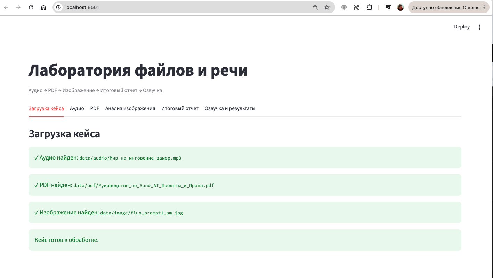
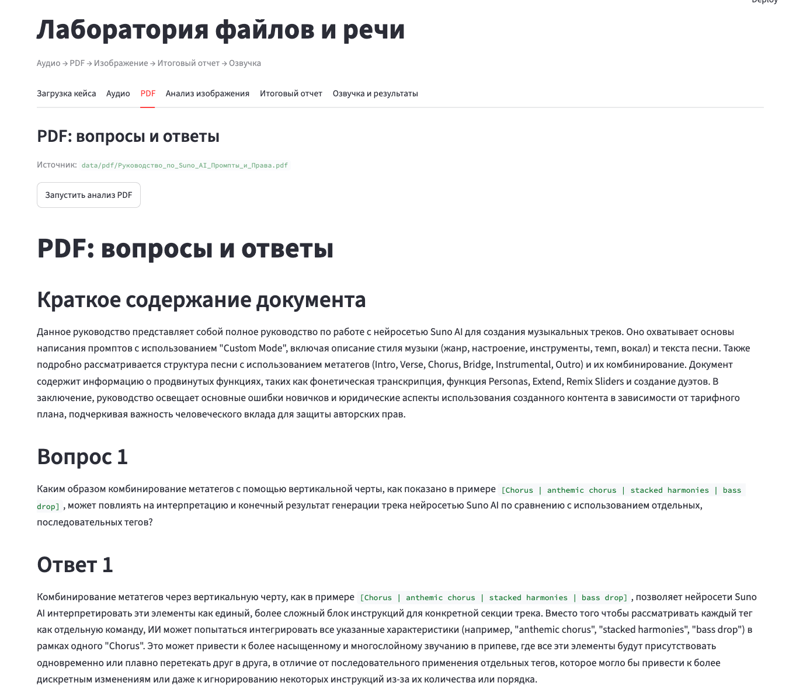
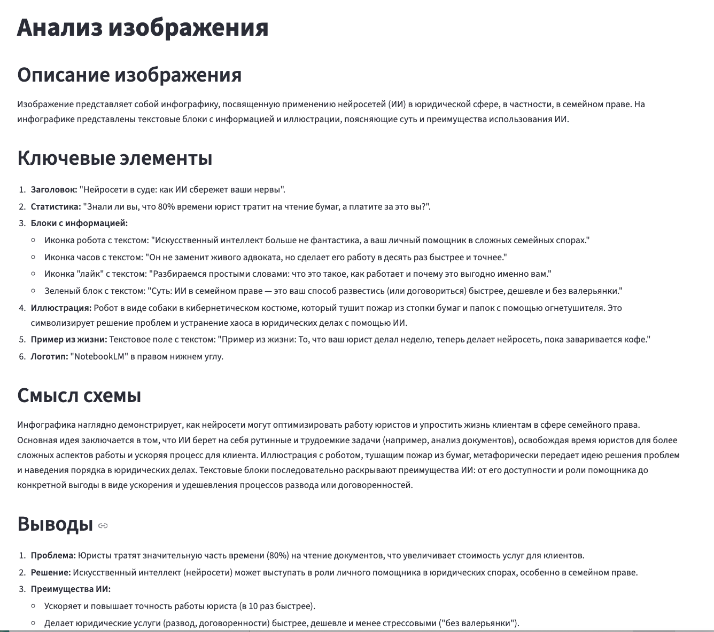
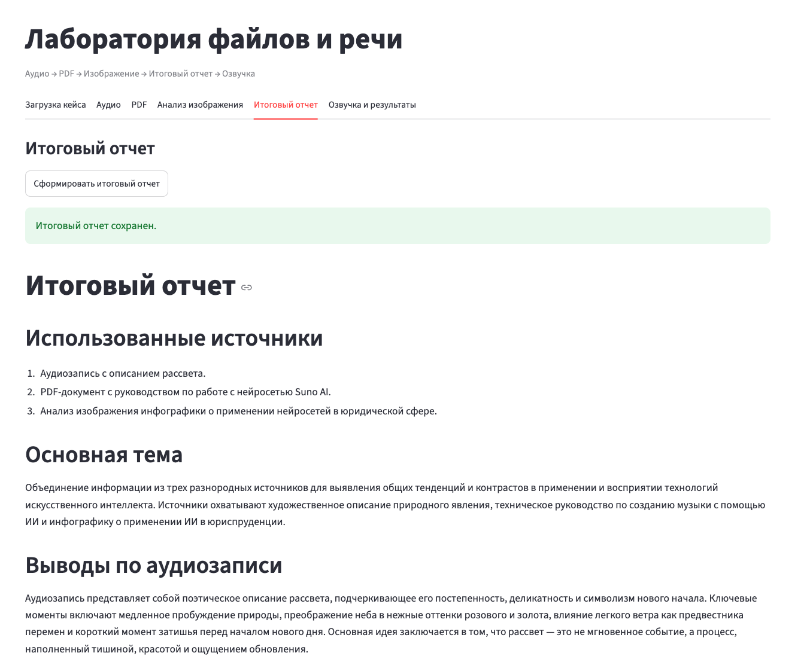
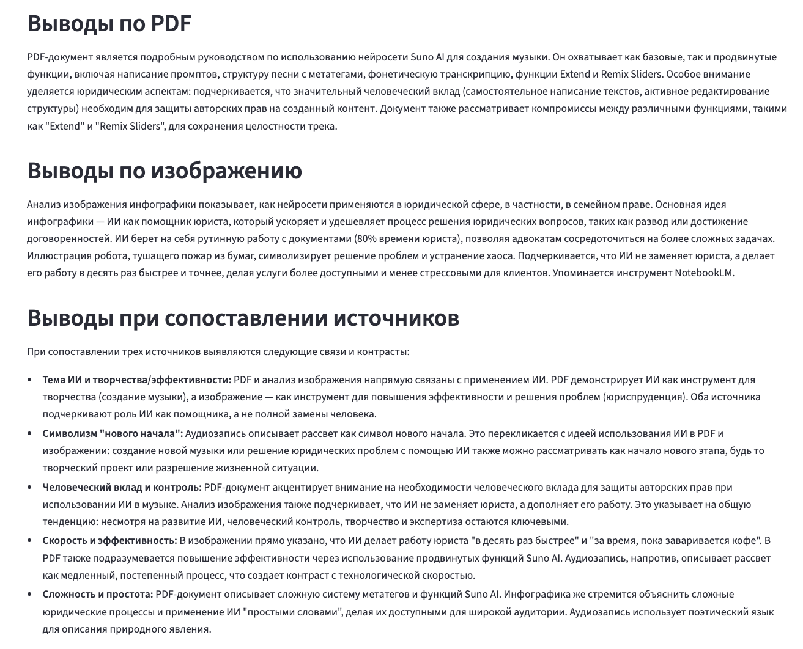
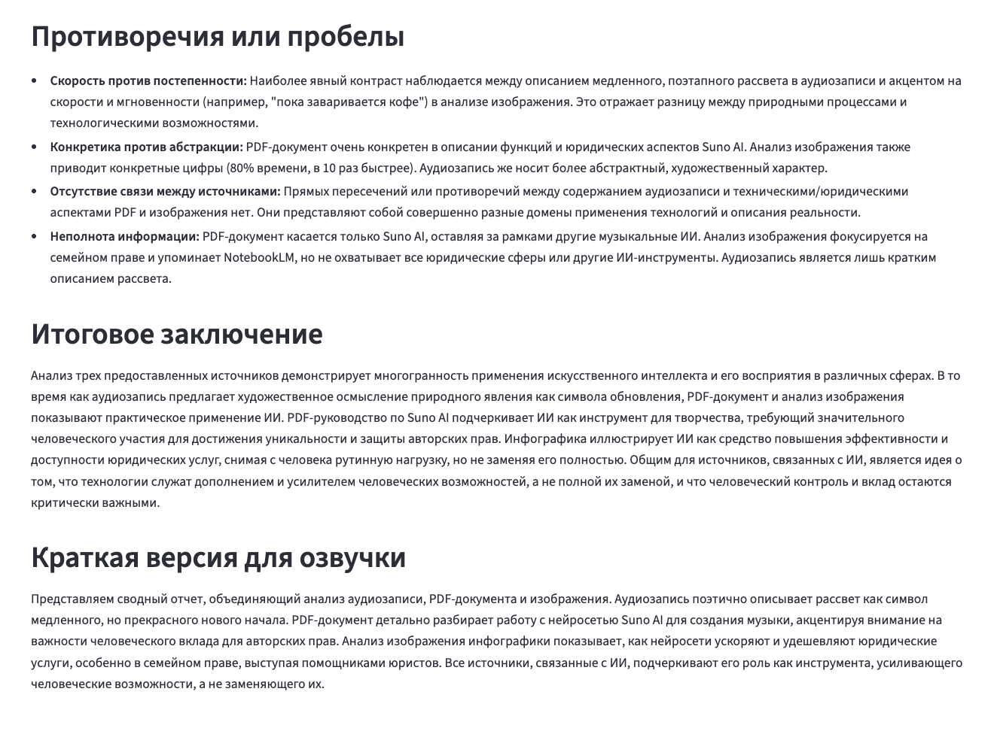
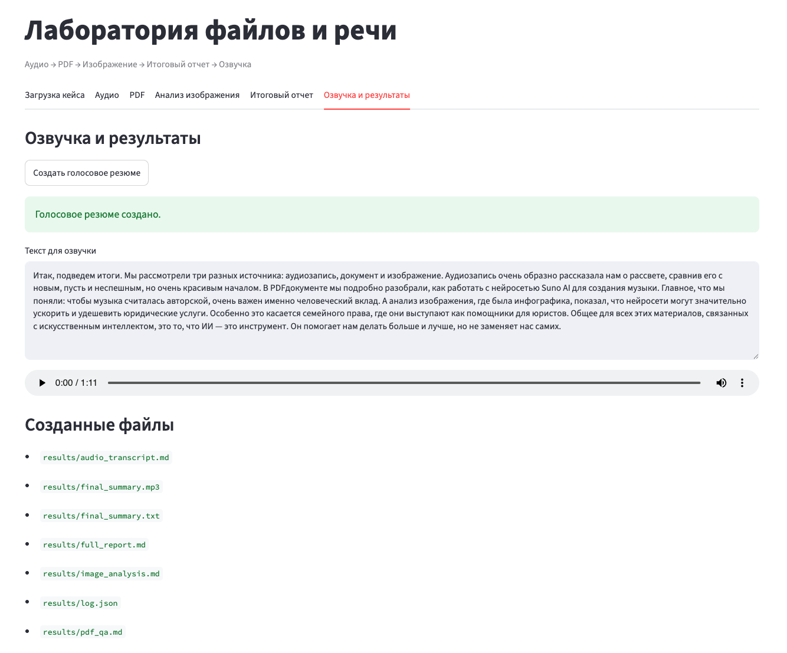

# 🤖 Нейропомощник

## Мультимодальный AI-помощник для работы с различными типами данных

Нейропомощник — веб-приложение, которое объединяет современные языковые модели и мультимодальный анализ для работы с текстом, документами, изображениями и голосом.

Проект демонстрирует возможность объединения нескольких AI-сервисов в единое приложение с удобным пользовательским интерфейсом.

> Проект завершён.

---

# 👩‍💻 Моя роль

В рамках проекта я отвечала за:

- проектирование архитектуры приложения;
- разработку backend;
- разработку frontend;
- интеграцию LLM;
- проектирование API;
- разработку мультимодального AI-конвейера;
- контейнеризацию приложения с использованием Docker.

---

# 🚀 Основные возможности

- 💬 Общение с AI-помощником
- 📄 Анализ документов
- 🖼️ Анализ изображений
- 🎤 Обработка голосовых сообщений
- 🧠 Объединение данных из нескольких источников в единый ответ
- 🌐 Современный веб-интерфейс

---

# 🛠️ Используемые технологии

### AI

- OpenRouter
- Gemini
- Prompt Engineering

### Backend

- Python
- FastAPI

### Frontend

- React
- TypeScript
- Tailwind CSS

### Инфраструктура

- Docker
- Git

---

# 📸 Интерфейс приложения

## Главная страница

---

## Работа с документами

---

## Анализ изображений

---

## Итоговый отчет

---

> Исходный код проекта доступен в открытом репозитории GitHub.
