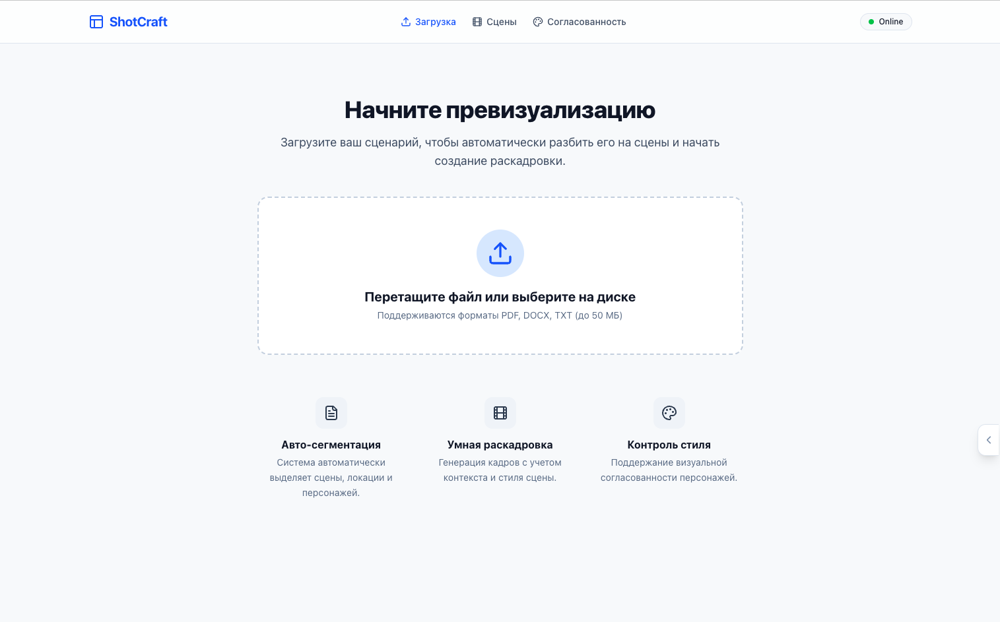
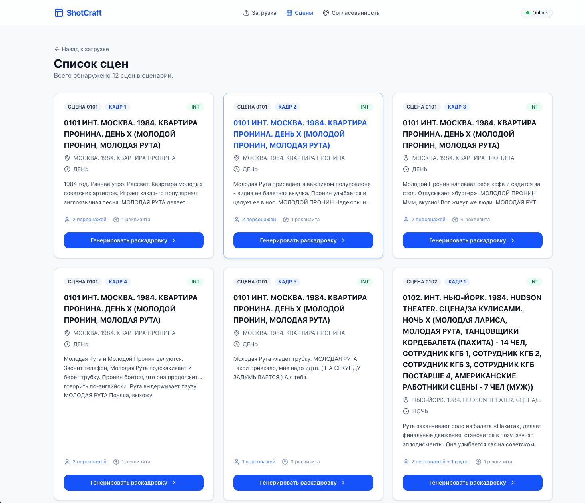
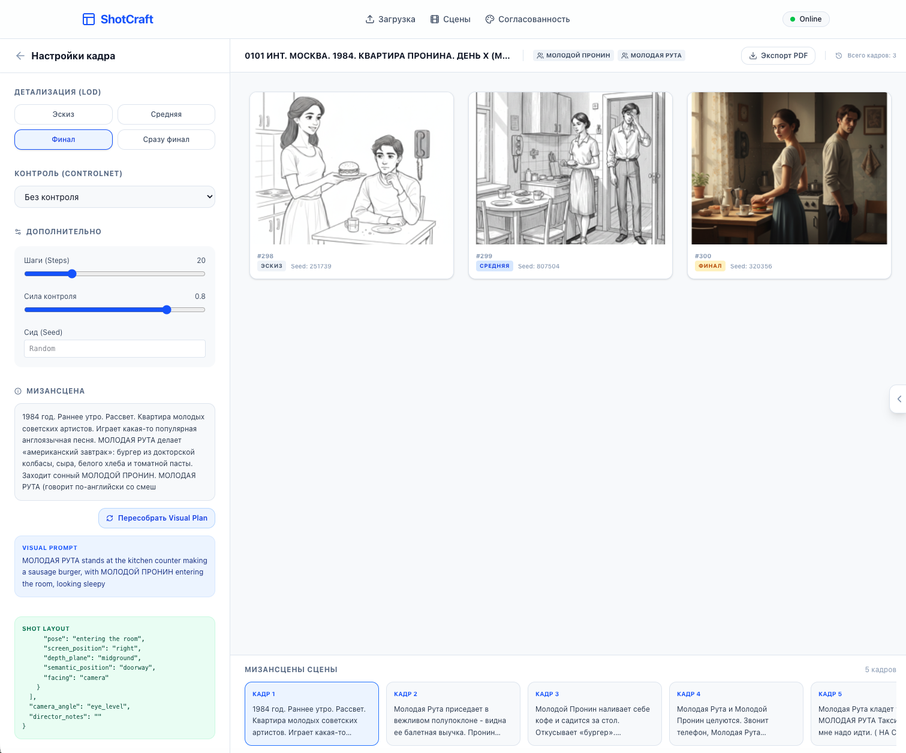
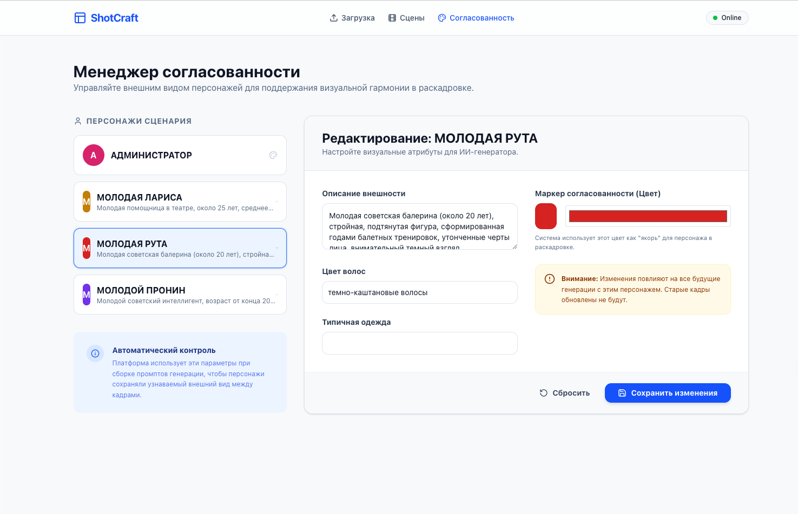

# 🎬 ShotCraft

## AI-платформа для семантического анализа сценариев и кинематографической превизуализации

ShotCraft — интеллектуальная AI-платформа, которая помогает превращать сценарий фильма в последовательную кинематографическую превизуализацию.

В отличие от обычных AI-генераторов изображений, платформа сначала анализирует сценарий, понимает структуру сцен, персонажей, окружение и контекст повествования, а затем формирует согласованные данные для генерации визуального материала.

Особое внимание уделяется сохранению целостности истории и визуальной согласованности между сценами.

> 🚧 Проект находится в активной разработке.

---

# 👩‍💻 Моя роль

В рамках проекта я отвечаю за:

- проектирование архитектуры платформы;
- разработку backend;
- проектирование AI-конвейера обработки сценариев;
- разработку системы семантического анализа сцен;
- разработку Prompt Compiler;
- разработку Character Continuity;
- разработку Environment Semantics;
- разработку Consistency Manager;
- интеграцию современных AI-моделей.

---

# 🚀 Основные возможности

- 📖 Анализ структуры сценария
- 🎭 Выделение персонажей и объектов
- 🌍 Семантическое понимание окружения и места действия
- 🎬 Кинематографическая интерпретация сцен
- 🧠 Формирование структурированных промптов
- 🔄 Сохранение визуальной согласованности персонажей между сценами
- 🎨 Подготовка данных для AI-превизуализации

---

# 🧩 Ключевые компоненты

- **Semantic Scene Analysis** — анализ структуры и содержания сцен.
- **Environment Semantics** — понимание пространства, окружения и атмосферы.
- **Character Continuity** — сохранение внешнего вида персонажей между сценами.
- **Prompt Compiler** — построение структурированных промптов для генерации изображений.
- **Consistency Manager** — контроль визуальной и логической согласованности всей последовательности сцен.

---

# 🛠️ Используемые технологии

### AI

- Gemini
- Stable Diffusion
- Prompt Engineering

### Backend

- Python
- FastAPI
- Pydantic

### Инфраструктура

- Docker
- Git

---

# 📸 Интерфейс платформы

## Главная страница

---

## Анализ сценария

---

## Превизуализация сцен

---

## Менеджер согласованности

---

> Исходный код проекта является приватным. В данном репозитории представлено описание проекта, используемых технологий и демонстрация интерфейса.
